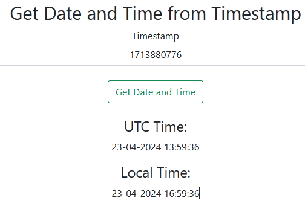

# Timestamp Microservice

A simple microservice that returns the current timestamp in Unix, UTC and Local format. Parses Timestamp to UTC and local time and date.

## App: 

- Generate Unix Timestamps UI

- Convert Timestamps to Date and Time
  

## API: 

- Generate Unix Timestamps

- Convert Timestamps to Date and Time

